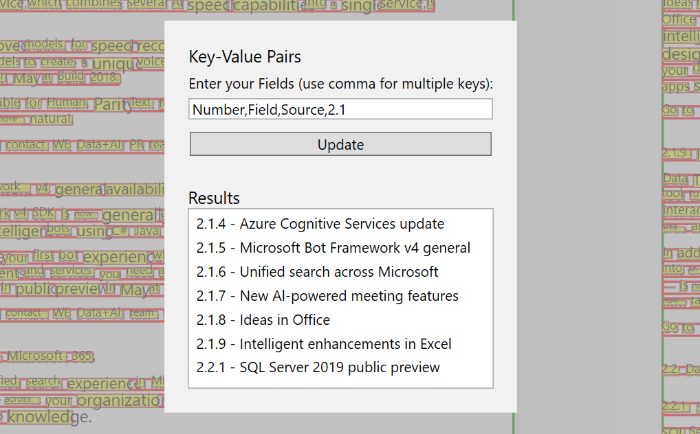
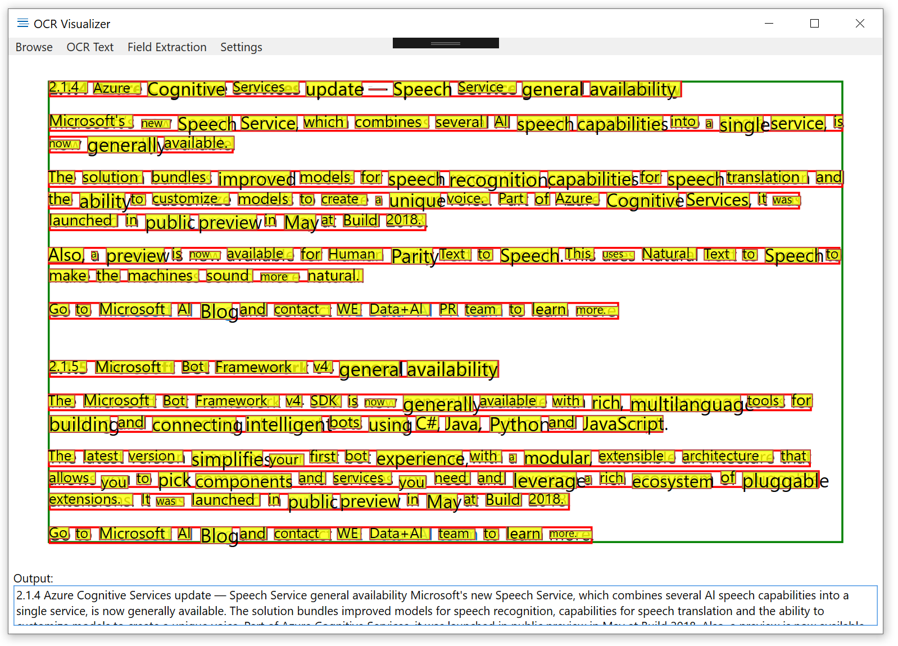
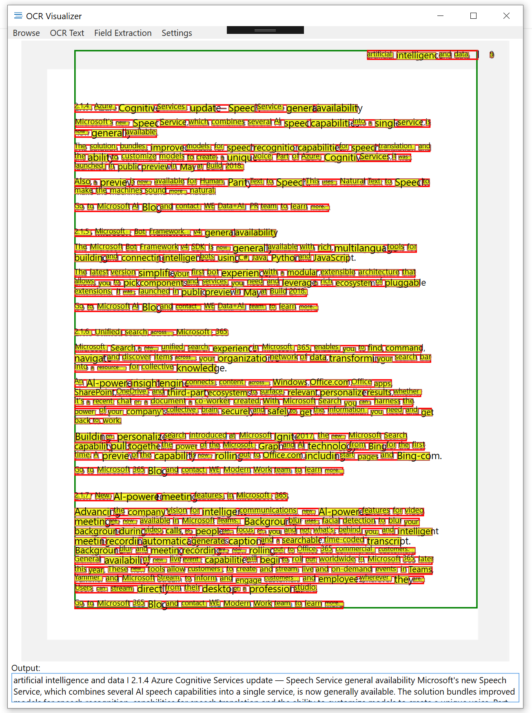

# OCR Visualizer
OCRVisualizer is a tool to visualize Microsoft Cognitive Services OCR API json output to get familiar with bounding boxes of Regions, Lines and Words. It's written in C#/WPF.

This tool will be helful for your data discovery, if you use OCR with your documents.

## Main Functinality
In this version;

* You can see bounding boxes of `Regions`, `Lines` and `Words`
* You can see extracted text over your original document
* You can extract full text as output
* You extract Key-Value Pairs

## Run Executable File
If you would like to test OCR visualizer on your local, download Setup File and update with your `subscription Key` and `endpoint` in `OCR Settings`. After defining your endpoint you can visualize your OCR documents via `Browse`.

* [Download OCRVisualizer Executable File on Windows](Setup/Release_Setup.zip) 

 


## Build the project

Please change in `App.config` file below code snippet with your Cognitive Services Computer Vision API subscription key and if your service hosted other than `northeurope` region, change the region with yours.

Microsoft Cognitive Services Computer Vision Endpoint details.

```json
<?xml version="1.0" encoding="utf-8"?>
<configuration>
  <startup>
    <supportedRuntime version="v4.0" sku=".NETFramework,Version=v4.6.1" />
  </startup>
  <appSettings>
    <add key="subscriptionKey" value="YOUR_COMPUTER_VISION_API_KEY" />
    <add key="endpointRegion" value="https://northeurope.api.cognitive.microsoft.com/vision/v2.0/ocr" />
    <add key="documentLanguage" value="unk" />
    <add key="searchValues" value="Number,Field,Source" />
  </appSettings>
</configuration>
```

Now you can define your `Field Extraction` under Key-Value pairs in `Manage Key-Value` under `Field Extraction` menu and values of these fields will be detected by their positions on the document and detected values will be listed in same panel.


Here are some examples of of output of documents.

Extract Key-Value Pairs



OCR for unstuctured documents.


OCR for a part of documents


OCR from full page documents 



For more information about Optical character recognition (OCR) in images | [Demo](https://azure.microsoft.com/en-us/services/cognitive-services/computer-vision/#text) | [Container Support](https://docs.microsoft.com/en-us/azure/cognitive-services/computer-vision/computer-vision-how-to-install-containers)


## OCR Supported languages:
* unk (AutoDetect)
* zh-Hans (ChineseSimplified)
* zh-Hant (ChineseTraditional)
* cs (Czech)
* da (Danish)
* nl (Dutch)
* en (English)
* fi (Finnish)
* fr (French)
* de (German)
* el (Greek)
* hu (Hungarian)
* it (Italian)
* ja (Japanese)
* ko (Korean)
* nb (Norwegian)
* pl (Polish)
* pt (Portuguese,
* ru (Russian)
* es (Spanish)
* sv (Swedish)
* tr (Turkish)
* ar (Arabic)
* ro (Romanian)
* sr-Cyrl (SerbianCyrillic)
* sr-Latn (SerbianLatin)
* sk (Slovak)

Thanks.